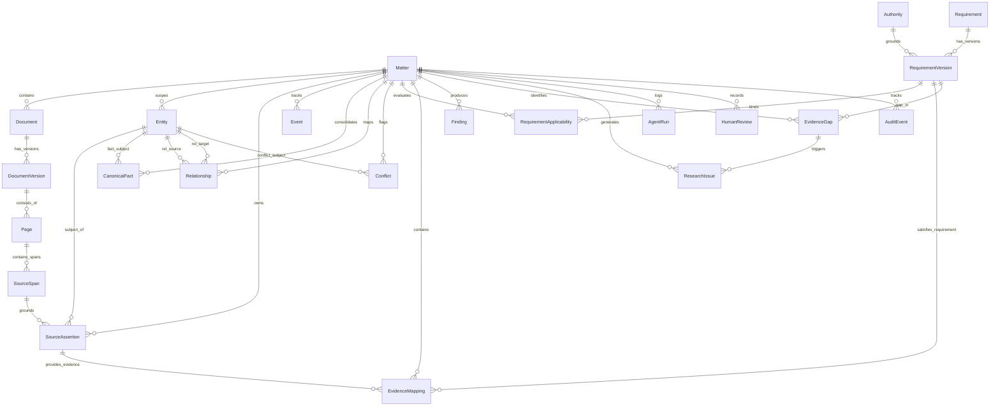

# LexMatter AI — Unified Ontology v0.2 Overview

This directory documents the complete **21-entity domain model** of LexMatter AI across 6 architectural layers.

---

## 1. The 6-Layer Architecture

```text
LEXMATTER MATTER ONTOLOGY (21 Models)
|
├── Layer 1: Source Layer          (Matter, Document, DocumentVersion, Page, SourceSpan)
├── Layer 2: Extraction Layer      (Entity, SourceAssertion, Event)
├── Layer 3: Knowledge Layer       (CanonicalFact, Relationship, Conflict)
├── Layer 4: Legal Knowledge Layer (Authority, Requirement, RequirementVersion, RequirementApplicability)
├── Layer 5: Analysis Layer        (EvidenceMapping, Finding, EvidenceGap, ResearchIssue)
└── Layer 6: Workflow/Audit Layer  (HumanReview, AgentRun, AuditEvent)
```

---

## 2. Complete System Entity-Relationship (ER) Diagram



---

## 3. Directory Index & Detailed Specifications

| Layer | Specification Document | Entities Defined | Core Responsibilities |
| :--- | :--- | :--- | :--- |
| **Layer 1** | [`source_layer.md`](./source_layer.md) | `Matter`, `Document`, `DocumentVersion`, `Page`, `SourceSpan` | Deterministic file hierarchy, OCR status, character offsets, and HNSW vector index |
| **Layer 2** | [`extraction_layer.md`](./extraction_layer.md) | `Entity`, `SourceAssertion`, `Event` | Immutable verbatim observations, named entities, and chronological timeline events |
| **Layer 3** | [`knowledge_layer.md`](./knowledge_layer.md) | `CanonicalFact`, `Relationship`, `Conflict` | Normalized facts across documents, inter-entity graphs, and contradiction tracking |
| **Layer 4** | [`legal_knowledge_layer.md`](./legal_knowledge_layer.md) | `Authority`, `Requirement`, `RequirementVersion`, `RequirementApplicability` | Statutory/USCIS policy manual citations, versioned evaluation dimensions, and semantic embeddings |
| **Layer 5** | [`analysis_layer.md`](./analysis_layer.md) | `EvidenceMapping`, `Finding`, `EvidenceGap`, `ResearchIssue` | Formal requirement-evidence links, guarded findings, potential gaps, and research triggers |
| **Layer 6** | [`workflow_audit_layer.md`](./workflow_audit_layer.md) | `AgentRun`, `HumanReview`, `AuditEvent` | LangGraph agent execution logs, attorney review decisions, and append-only audit trail |

---

## 4. Key Architectural Guarantees

1. **Prefix-Typed Identifiers:** All primary keys utilize distinct typed prefixes (`mat_`, `doc_`, `span_`, `asrt_`, `fact_`, `conf_`, `req_`, `evm_`, `find_`, `rev_`, `run_`, `aud_`) for clean debugging and trace readability.
2. **Two-World Separation:** Raw observations in `SourceAssertion` are never overwritten by analytical findings in `CanonicalFact` or `Conflict`.
3. **Character-Level Provenance:** Every evidence item and finding traces back to a `SourceSpan` with exact character indices and PDF bounding-box coordinates for click-to-highlight UI support.
4. **Hybrid Search Ready:** Both `SourceSpan` and `RequirementVersion` include `vector(768)` columns with pgvector HNSW cosine distance indexes.
