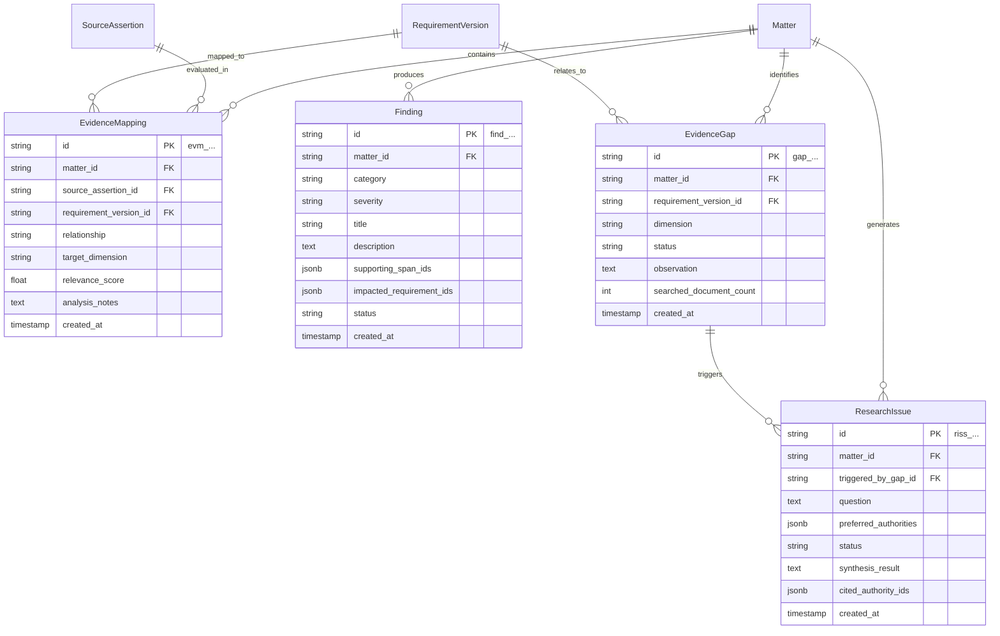

# LexMatter AI — Ontology Layer 5: Analysis Layer Specification

The **Analysis Layer** represents the analytical reasoning performed by AI agents or deterministic rules over consolidated matter facts and versioned legal requirements.

### Core Architectural Principle (Finding vs Fact & Guarded Conclusions)
1. **Finding vs Fact:** A `Fact` is information extracted about the matter (e.g., *"Rajesh Sharma joined June 2021"*). A `Finding` is an analytical judgment about that fact (e.g., *"Employment start date in resume contradicts verification letter"*).
2. **Safe Boundary:** Findings and evidence gaps never state *"This petition will be denied."* Instead, they identify potential evidence gaps, corroboration levels, and contradiction flags for human attorney review.

---

## Entity Relationship Overview (Analysis Layer)



---

## 1. Model: `EvidenceMapping`

### 1.1 Purpose
Represents the formal link between an immutable assertion (`SourceAssertion`) and a legal standard (`RequirementVersion`).

### 1.2 Schema Definition

| Field Name | Type | Nullable | Default | Description / Constraints |
| :--- | :--- | :--- | :--- | :--- |
| `id` | `VARCHAR(32)` | No | Auto-generated | Primary Key. Prefix: `evm_`. |
| `matter_id` | `VARCHAR(32)` | No | — | Foreign Key -> `matters.id` (ON DELETE CASCADE). |
| `source_assertion_id` | `VARCHAR(32)` | No | — | Foreign Key -> `source_assertions.id` (ON DELETE CASCADE). |
| `requirement_version_id` | `VARCHAR(32)` | No | — | Foreign Key -> `requirement_versions.id` (ON DELETE RESTRICT). |
| `relationship` | `VARCHAR(50)` | No | — | Enum: `SUPPORTS`, `PARTIALLY_SUPPORTS`, `CONTRADICTS`, `CONTEXT_ONLY`, `DUPLICATES`, `UNCLEAR`. |
| `target_dimension` | `VARCHAR(100)` | Yes | `NULL` | Dimension evaluated (e.g., `"proprietary_nature"`, `"qualifying_capacity"`). |
| `relevance_score` | `FLOAT` | No | `1.0` | Relevance score (`0.0` to `1.0`). |
| `analysis_notes` | `TEXT` | Yes | `NULL` | Detailed reasoning explaining how this assertion satisfies the dimension. |
| `created_at` | `TIMESTAMPTZ` | No | `NOW()` | Mapping creation timestamp. |

### 1.3 Indexes & Constraints
* `pk_evidence_mappings`: `PRIMARY KEY (id)`
* `fk_evm_matter`: `FOREIGN KEY (matter_id) REFERENCES matters(id)`
* `fk_evm_assertion`: `FOREIGN KEY (source_assertion_id) REFERENCES source_assertions(id)`
* `fk_evm_req_version`: `FOREIGN KEY (requirement_version_id) REFERENCES requirement_versions(id)`
* `idx_evm_lookup`: `(matter_id, requirement_version_id, relationship)`

### 1.4 Example JSON
```json
{
  "id": "evm_01J8K3MG0A1B2C3D4E5F6G7H8J",
  "matter_id": "mat_01J8K3M90A1B2C3D4E5F6G7H8J",
  "source_assertion_id": "asrt_01J8K3MB5P6Q7R8S9T0U1V2W3X",
  "requirement_version_id": "reqv_01J8K3MF0A1B2C3D4E5F6G7H8J",
  "relationship": "SUPPORTS",
  "target_dimension": "proprietary_product_or_process",
  "relevance_score": 0.94,
  "analysis_notes": "The support letter explicitly establishes that the Apex Titan Risk Engine is an internally developed proprietary framework not commercially available to competitors.",
  "created_at": "2026-09-21T10:08:00Z"
}
```

---

## 2. Model: `Finding`

### 2.1 Purpose
Encapsulates an analytical conclusion, risk assessment, or consistency flag generated by LexMatter agents.

### 2.2 Schema Definition

| Field Name | Type | Nullable | Default | Description / Constraints |
| :--- | :--- | :--- | :--- | :--- |
| `id` | `VARCHAR(32)` | No | Auto-generated | Primary Key. Prefix: `find_`. |
| `matter_id` | `VARCHAR(32)` | No | — | Foreign Key -> `matters.id` (ON DELETE CASCADE). |
| `category` | `VARCHAR(50)` | No | — | Enum: `CONSISTENCY`, `EVIDENCE_STRENGTH`, `ELIGIBILITY_RISK`, `PROCEDURAL_DEFECT`. |
| `severity` | `VARCHAR(20)` | No | `'MEDIUM'` | Enum: `INFO`, `LOW`, `MEDIUM`, `HIGH`, `CRITICAL`. |
| `title` | `VARCHAR(255)` | No | — | Clear title (e.g., `"Foreign employment start date discrepancy"`). |
| `description` | `TEXT` | No | — | Narrative explanation of the finding and its impact. |
| `supporting_span_ids` | `JSONB` | No | `[]` | Array of `SourceSpan.id` citation references. |
| `impacted_requirement_ids` | `JSONB` | No | `[]` | Array of `Requirement.id` references. |
| `status` | `VARCHAR(50)` | No | `'PENDING_REVIEW'` | Enum: `PENDING_REVIEW`, `ACCEPTED`, `REJECTED`, `MODIFIED`. |
| `created_at` | `TIMESTAMPTZ` | No | `NOW()` | Creation timestamp. |

### 2.3 Indexes & Constraints
* `pk_findings`: `PRIMARY KEY (id)`
* `fk_findings_matter`: `FOREIGN KEY (matter_id) REFERENCES matters(id)`
* `idx_findings_matter_status`: `(matter_id, status, severity)`
* `idx_findings_spans_gin`: `USING GIN (supporting_span_ids)`

### 2.4 Example JSON
```json
{
  "id": "find_01J8K3MG5E6F7G8H9J0K1L2M3N",
  "matter_id": "mat_01J8K3M90A1B2C3D4E5F6G7H8J",
  "category": "CONSISTENCY",
  "severity": "HIGH",
  "title": "Discrepancy in foreign employment start date",
  "description": "The Beneficiary's Resume asserts employment began in June 2021, whereas the Foreign Employer Verification Letter and Form I-129 Supplement indicate May 15, 2021.",
  "supporting_span_ids": [
    "span_01J8K3MA7M8N9P0Q1R2S3T4U5V",
    "span_01J8K3MA8A1B2C3D4E5F6G7H8J"
  ],
  "impacted_requirement_ids": [
    "req_01J8K3ME5E6F7G8H9J0K1L2M3N"
  ],
  "status": "PENDING_REVIEW",
  "created_at": "2026-09-21T10:08:15Z"
}
```

---

## 3. Model: `EvidenceGap`

### 3.1 Purpose
Identifies missing or weakly supported requirement dimensions in the case package, proposing specific areas where additional documentation should be gathered.

### 3.2 Schema Definition

| Field Name | Type | Nullable | Default | Description / Constraints |
| :--- | :--- | :--- | :--- | :--- |
| `id` | `VARCHAR(32)` | No | Auto-generated | Primary Key. Prefix: `gap_`. |
| `matter_id` | `VARCHAR(32)` | No | — | Foreign Key -> `matters.id` (ON DELETE CASCADE). |
| `requirement_version_id` | `VARCHAR(32)` | No | — | Foreign Key -> `requirement_versions.id` (ON DELETE RESTRICT). |
| `dimension` | `VARCHAR(100)` | No | — | Dimension name (e.g., `"organizational_comparison"`). |
| `status` | `VARCHAR(50)` | No | `'POTENTIAL_GAP'` | Enum: `POTENTIAL_GAP`, `DOCUMENT_REQUESTED`, `RESOLVED`, `DISMISSED`. |
| `observation` | `TEXT` | No | — | Safe factual explanation of what evidence is currently missing. |
| `searched_document_count` | `INTEGER` | No | `0` | Number of documents evaluated across the matter. |
| `created_at` | `TIMESTAMPTZ` | No | `NOW()` | Creation timestamp. |

### 3.3 Indexes & Constraints
* `pk_evidence_gaps`: `PRIMARY KEY (id)`
* `fk_gaps_matter`: `FOREIGN KEY (matter_id) REFERENCES matters(id)`
* `fk_gaps_req_version`: `FOREIGN KEY (requirement_version_id) REFERENCES requirement_versions(id)`
* `idx_gaps_status`: `(matter_id, status)`

### 3.4 Example JSON
```json
{
  "id": "gap_01J8K3MH0A1B2C3D4E5F6G7H8J",
  "matter_id": "mat_01J8K3M90A1B2C3D4E5F6G7H8J",
  "requirement_version_id": "reqv_01J8K3MF0A1B2C3D4E5F6G7H8J",
  "dimension": "organizational_comparison",
  "status": "POTENTIAL_GAP",
  "observation": "Existing documents describe the beneficiary's advanced skills, but limited comparative evidence was found illustrating how the beneficiary's knowledge differs from other senior engineers in the organization.",
  "searched_document_count": 8,
  "created_at": "2026-09-21T10:08:30Z"
}
```

---

## 4. Model: `ResearchIssue`

### 4.1 Purpose
A formal query passed to the Research Agent to retrieve relevant statutory, administrative, or precedent guidance from authoritative repositories.

### 4.2 Schema Definition

| Field Name | Type | Nullable | Default | Description / Constraints |
| :--- | :--- | :--- | :--- | :--- |
| `id` | `VARCHAR(32)` | No | Auto-generated | Primary Key. Prefix: `riss_`. |
| `matter_id` | `VARCHAR(32)` | No | — | Foreign Key -> `matters.id` (ON DELETE CASCADE). |
| `triggered_by_gap_id` | `VARCHAR(32)` | Yes | `NULL` | Foreign Key -> `evidence_gaps.id` (optional originating gap). |
| `question` | `TEXT` | No | — | Focused legal research question. |
| `preferred_authorities` | `JSONB` | No | `[]` | List of target authority types (e.g., `["USCIS_POLICY_MANUAL", "AAO_DECISION"]`). |
| `status` | `VARCHAR(50)` | No | `'OPEN'` | Enum: `OPEN`, `IN_PROGRESS`, `ANSWERED`, `FAILED`. |
| `synthesis_result` | `TEXT` | Yes | `NULL` | Research agent's source-grounded answer. |
| `cited_authority_ids` | `JSONB` | No | `[]` | Array of `Authority.id` references cited in the answer. |
| `created_at` | `TIMESTAMPTZ` | No | `NOW()` | Creation timestamp. |

### 4.3 Indexes & Constraints
* `pk_research_issues`: `PRIMARY KEY (id)`
* `fk_riss_matter`: `FOREIGN KEY (matter_id) REFERENCES matters(id)`
* `fk_riss_gap`: `FOREIGN KEY (triggered_by_gap_id) REFERENCES evidence_gaps(id)`
* `idx_riss_status`: `(matter_id, status)`

### 4.4 Example JSON
```json
{
  "id": "riss_01J8K3MH5E6F7G8H9J0K1L2M3N",
  "matter_id": "mat_01J8K3M90A1B2C3D4E5F6G7H8J",
  "triggered_by_gap_id": "gap_01J8K3MH0A1B2C3D4E5F6G7H8J",
  "question": "What USCIS Policy Manual guidance governs how specialized knowledge should be compared against general industry or organizational peers?",
  "preferred_authorities": [
    "USCIS_POLICY_MANUAL",
    "AAO_DECISION"
  ],
  "status": "ANSWERED",
  "synthesis_result": "Under USCIS Policy Manual Vol 2, Part L, specialized knowledge does not require the beneficiary to be the sole individual with such knowledge, but the petitioner must demonstrate that the knowledge is uncommon and not easily transferable across the industry.",
  "cited_authority_ids": [
    "auth_01J8K3ME0A1B2C3D4E5F6G7H8J"
  ],
  "created_at": "2026-09-21T10:08:45Z"
}
```
