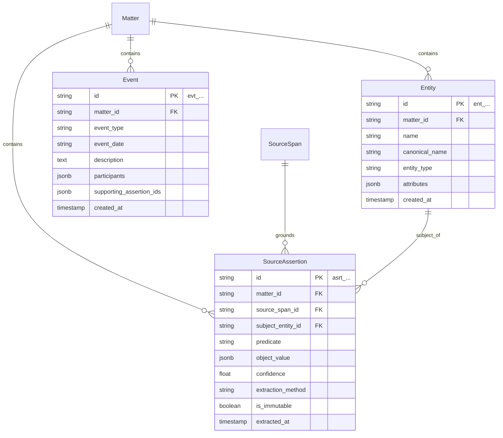

# LexMatter AI — Ontology Layer 2: Extraction Layer Specification

The **Extraction Layer** contains the structured observations produced directly from source documents by deterministic extraction heuristics or LLM structured extraction. 

### Core Architectural Principle (Two-World Separation)
1. **World 1 (Observations):** Everything in this layer represents an immutable observation of what a source text *claims*. Even if two documents make contradictory assertions, both assertions remain permanently stored and unaltered.
2. **World 2 (Consolidation):** Reasoning about whether an assertion is accurate, corroborated, or conflicting occurs in Layer 3 (Knowledge Layer), leaving Layer 2 records untouched.

---

## Entity Relationship Overview (Extraction Layer)



---

## 1. Model: `Entity`

### 1.1 Purpose
Represents a real-world person, organization, system, title, location, or artifact identified in the matter documents. Provides a normalized `canonical_name` to facilitate identity resolution across varied document spelling styles (e.g., *"Rajesh Sharma"*, *"R. Sharma"*, *"Mr. Rajesh Sharma"*).

### 1.2 Schema Definition

| Field Name | Type | Nullable | Default | Description / Constraints |
| :--- | :--- | :--- | :--- | :--- |
| `id` | `VARCHAR(32)` | No | Auto-generated | Primary Key. Prefix: `ent_`. |
| `matter_id` | `VARCHAR(32)` | No | — | Foreign Key -> `matters.id` (ON DELETE CASCADE). |
| `name` | `VARCHAR(255)` | No | — | Surface name as extracted (e.g., `"Apex Global Technologies LLC"`). |
| `canonical_name` | `VARCHAR(255)` | No | — | Normalized lowercase string for matching (e.g., `"apex global technologies llc"`). |
| `entity_type` | `VARCHAR(50)` | No | — | Enum: `PERSON`, `ORGANIZATION`, `ROLE_TITLE`, `PRODUCT_SYSTEM`, `LOCATION`, `DATE_PERIOD`, `DOCUMENT_REF`. |
| `attributes` | `JSONB` | No | `{}` | Extensible metadata (e.g., `{"ein": "12-3456789", "state": "CA", "country": "US"}`). |
| `created_at` | `TIMESTAMPTZ` | No | `NOW()` | Creation timestamp. |

### 1.3 Indexes & Constraints
* `pk_entities`: `PRIMARY KEY (id)`
* `fk_entities_matter`: `FOREIGN KEY (matter_id) REFERENCES matters(id)`
* `idx_entities_canonical`: `(matter_id, entity_type, canonical_name)`
* `idx_entities_attrs_gin`: `USING GIN (attributes)`

### 1.4 Example JSON
```json
{
  "id": "ent_01J8K3MB0E1F2G3H4J5K6L7M8N",
  "matter_id": "mat_01J8K3M90A1B2C3D4E5F6G7H8J",
  "name": "Apex Titan Risk Engine",
  "canonical_name": "apex titan risk engine",
  "entity_type": "PRODUCT_SYSTEM",
  "attributes": {
    "category": "Proprietary Software Architecture",
    "internal_id": "TITAN-V3",
    "domain": "Algorithmic Risk Scoring"
  },
  "created_at": "2026-09-21T10:05:00Z"
}
```

---

## 2. Model: `SourceAssertion` — Immutable Observation

### 2.1 Purpose
Represents an atomic, structured fact asserted by a specific `SourceSpan`. It connects a subject entity, a predicate attribute, and a structured object value directly to its character span coordinates.

> **Immutability Invariant:** Once written to the database, a `SourceAssertion` is never modified or deleted during case analysis. If two documents disagree on a date, both assertions are preserved independently.

### 2.2 Schema Definition

| Field Name | Type | Nullable | Default | Description / Constraints |
| :--- | :--- | :--- | :--- | :--- |
| `id` | `VARCHAR(32)` | No | Auto-generated | Primary Key. Prefix: `asrt_`. |
| `matter_id` | `VARCHAR(32)` | No | — | Foreign Key -> `matters.id` (ON DELETE CASCADE). |
| `source_span_id` | `VARCHAR(32)` | No | — | Foreign Key -> `source_spans.id` (ON DELETE RESTRICT). |
| `subject_entity_id` | `VARCHAR(32)` | Yes | `NULL` | Foreign Key -> `entities.id` (Subject of the claim). |
| `predicate` | `VARCHAR(100)` | No | — | Claim attribute (e.g., `employment_start_date`, `job_title`, `salary`, `specialized_tool_used`, `qualifying_relationship`). |
| `object_value` | `JSONB` | No | — | Structured payload containing parsed value and surface raw text (e.g., `{"value": "2021-06-01", "raw_text": "June 2021"}`). |
| `confidence` | `FLOAT` | No | `1.0` | Extraction confidence score (`0.0` to `1.0`). |
| `extraction_method` | `VARCHAR(50)` | No | `'LLM_STRUCTURED'` | Enum: `REGEX`, `LAYOUT_HEURISTIC`, `LLM_STRUCTURED`, `MANUAL_ENTRY`. |
| `is_immutable` | `BOOLEAN` | No | `TRUE` | Always `TRUE`. Enforced via database triggers/rules. |
| `extracted_at` | `TIMESTAMPTZ` | No | `NOW()` | Extraction audit timestamp. |

### 2.3 Indexes & Constraints
* `pk_source_assertions`: `PRIMARY KEY (id)`
* `fk_source_assertions_matter`: `FOREIGN KEY (matter_id) REFERENCES matters(id)`
* `fk_source_assertions_span`: `FOREIGN KEY (source_span_id) REFERENCES source_spans(id)`
* `fk_source_assertions_subject`: `FOREIGN KEY (subject_entity_id) REFERENCES entities(id)`
* `idx_assertions_lookup`: `(matter_id, predicate, subject_entity_id)`
* `idx_assertions_value_gin`: `USING GIN (object_value)`

### 2.4 Example JSON
```json
{
  "id": "asrt_01J8K3MB5P6Q7R8S9T0U1V2W3X",
  "matter_id": "mat_01J8K3M90A1B2C3D4E5F6G7H8J",
  "source_span_id": "span_01J8K3MA7M8N9P0Q1R2S3T4U5V",
  "subject_entity_id": "ent_01J8K3MB0E1F2G3H4J5K6L7M8N",
  "predicate": "foreign_employment_start_date",
  "object_value": {
    "normalized_value": "2021-06-01",
    "raw_text": "June 2021",
    "precision": "MONTH"
  },
  "confidence": 0.96,
  "extraction_method": "LLM_STRUCTURED",
  "is_immutable": true,
  "extracted_at": "2026-09-21T10:05:12Z"
}
```

---

## 3. Model: `Event`

### 3.1 Purpose
Captures discrete chronological milestones in a matter to dynamically synthesize timelines (e.g., employment history, project lifecycles, corporate reorganizations, immigration filings).

### 3.2 Schema Definition

| Field Name | Type | Nullable | Default | Description / Constraints |
| :--- | :--- | :--- | :--- | :--- |
| `id` | `VARCHAR(32)` | No | Auto-generated | Primary Key. Prefix: `evt_`. |
| `matter_id` | `VARCHAR(32)` | No | — | Foreign Key -> `matters.id` (ON DELETE CASCADE). |
| `event_type` | `VARCHAR(50)` | No | — | Enum: `EMPLOYMENT_START`, `EMPLOYMENT_END`, `PROMOTION`, `TRAINING_COMPLETED`, `PATENT_FILED`, `PROJECT_LAUNCH`, `PETITION_SUBMITTED`, `DEGREE_CONFERRED`, `GENERAL_MILESTONE`. |
| `event_date` | `VARCHAR(50)` | No | — | ISO-8601 date or partial date string (e.g., `"2021-06-01"`, `"2021-06"`, `"2021"`). |
| `description` | `TEXT` | No | — | Clear narrative summary of the milestone. |
| `participants` | `JSONB` | No | `[]` | Array of involved `Entity.id` strings (e.g., `["ent_...", "ent_..."]`). |
| `supporting_assertion_ids` | `JSONB` | No | `[]` | Array of `SourceAssertion.id` strings that substantiate this event. |
| `created_at` | `TIMESTAMPTZ` | No | `NOW()` | Creation timestamp. |

### 3.3 Indexes & Constraints
* `pk_events`: `PRIMARY KEY (id)`
* `fk_events_matter`: `FOREIGN KEY (matter_id) REFERENCES matters(id)`
* `idx_events_timeline`: `(matter_id, event_date, event_type)`
* `idx_events_participants_gin`: `USING GIN (participants)`
* `idx_events_assertions_gin`: `USING GIN (supporting_assertion_ids)`

### 3.4 Example JSON
```json
{
  "id": "evt_01J8K3MB9X8W7V6U5T4S3R2Q1P",
  "matter_id": "mat_01J8K3M90A1B2C3D4E5F6G7H8J",
  "event_type": "EMPLOYMENT_START",
  "event_date": "2021-06-01",
  "description": "Rajesh Sharma commenced foreign employment as Lead Architect at Apex India Pvt. Ltd.",
  "participants": [
    "ent_01J8K3MB0E1F2G3H4J5K6L7M8N",
    "ent_01J8K3MB1A2B3C4D5E6F7G8H9J"
  ],
  "supporting_assertion_ids": [
    "asrt_01J8K3MB5P6Q7R8S9T0U1V2W3X"
  ],
  "created_at": "2026-09-21T10:05:20Z"
}
```
