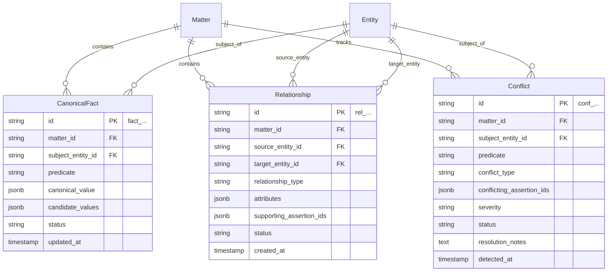

# LexMatter AI — Ontology Layer 3: Knowledge Layer Specification

The **Knowledge Layer** represents the platform's consolidated understanding of facts, relationships, and contradictions across all documents in a matter.

### Core Architectural Principle (World 2: Consolidated Knowledge)
* While Layer 2 (`SourceAssertion`) stores immutable verbatim observations of what each document claims, Layer 3 reconciles those assertions into unified **Canonical Facts**, extracts **Inter-Entity Relationships**, and explicitly tracks **Conflicts** when documents disagree.
* **No silent overwrites:** If document A says *"Start Date: May 2021"* and document B says *"Start Date: June 2021"*, the system does not average or silently discard either claim; it creates a `Conflict` object for human review.

---

## Entity Relationship Overview (Knowledge Layer)



---

## 1. Model: `CanonicalFact`

### 1.1 Purpose
Represents the reconciled or consensus fact regarding an entity's attribute within the matter. Groups multiple corroborating assertions together and preserves all candidate values if discrepancies exist.

### 1.2 Schema Definition

| Field Name | Type | Nullable | Default | Description / Constraints |
| :--- | :--- | :--- | :--- | :--- |
| `id` | `VARCHAR(32)` | No | Auto-generated | Primary Key. Prefix: `fact_`. |
| `matter_id` | `VARCHAR(32)` | No | — | Foreign Key -> `matters.id` (ON DELETE CASCADE). |
| `subject_entity_id` | `VARCHAR(32)` | No | — | Foreign Key -> `entities.id` (Entity whose fact this is). |
| `predicate` | `VARCHAR(100)` | No | — | Fact attribute (e.g., `date_of_birth`, `foreign_employer`, `foreign_job_title`, `salary`). |
| `canonical_value` | `JSONB` | Yes | `NULL` | Reconciled/accepted value payload (e.g., `{"value": "2021-05-15", "type": "DATE"}`). |
| `candidate_values` | `JSONB` | No | `[]` | Array of grouped assertion candidates with supporting assertion IDs. |
| `status` | `VARCHAR(50)` | No | `'UNCONTESTED'` | Enum: `UNCONTESTED`, `CORROBORATED`, `CONFLICTING`, `RESOLVED_BY_HUMAN`. |
| `created_at` | `TIMESTAMPTZ` | No | `NOW()` | Creation timestamp. |
| `updated_at` | `TIMESTAMPTZ` | No | `NOW()` | Update timestamp. |

### 1.3 Indexes & Constraints
* `pk_canonical_facts`: `PRIMARY KEY (id)`
* `fk_canonical_facts_matter`: `FOREIGN KEY (matter_id) REFERENCES matters(id)`
* `fk_canonical_facts_subject`: `FOREIGN KEY (subject_entity_id) REFERENCES entities(id)`
* `uq_canonical_facts_subject_pred`: `UNIQUE (matter_id, subject_entity_id, predicate)`
* `idx_canonical_facts_status`: `(matter_id, status)`

### 1.4 Example JSON
```json
{
  "id": "fact_01J8K3MC0A1B2C3D4E5F6G7H8J",
  "matter_id": "mat_01J8K3M90A1B2C3D4E5F6G7H8J",
  "subject_entity_id": "ent_01J8K3MB0E1F2G3H4J5K6L7M8N",
  "predicate": "foreign_employment_start_date",
  "canonical_value": {
    "normalized_value": "2021-05-15",
    "type": "DATE"
  },
  "candidate_values": [
    {
      "value": "2021-05-15",
      "supporting_assertions": [
        "asrt_01J8K3MB5P6Q7R8S9T0U1V2W3X",
        "asrt_01J8K3MB6A7B8C9D0E1F2G3H4J"
      ]
    },
    {
      "value": "2021-06-01",
      "supporting_assertions": [
        "asrt_01J8K3MB7K8L9M0N1P2Q3R4S5T"
      ]
    }
  ],
  "status": "CONFLICTING",
  "created_at": "2026-09-21T10:06:00Z",
  "updated_at": "2026-09-21T10:06:05Z"
}
```

---

## 2. Model: `Relationship`

### 2.1 Purpose
Represents typed, directed semantic connections between entities within a matter (e.g., corporate ownership structures, employment relationships, project assignments).

### 2.2 Schema Definition

| Field Name | Type | Nullable | Default | Description / Constraints |
| :--- | :--- | :--- | :--- | :--- |
| `id` | `VARCHAR(32)` | No | Auto-generated | Primary Key. Prefix: `rel_`. |
| `matter_id` | `VARCHAR(32)` | No | — | Foreign Key -> `matters.id` (ON DELETE CASCADE). |
| `source_entity_id` | `VARCHAR(32)` | No | — | Foreign Key -> `entities.id` (Subject entity). |
| `target_entity_id` | `VARCHAR(32)` | No | — | Foreign Key -> `entities.id` (Object entity). |
| `relationship_type` | `VARCHAR(50)` | No | — | Enum: `EMPLOYED_BY`, `SUBSIDIARY_OF`, `PARENT_COMPANY_OF`, `AFFILIATE_OF`, `WORKED_ON_PROJECT`, `REPORTS_TO`, `CREATOR_OF`, `LOCATED_IN`. |
| `attributes` | `JSONB` | No | `{}` | Details (e.g., `{"ownership_percentage": 100, "start_date": "2018-01-01"}`). |
| `supporting_assertion_ids` | `JSONB` | No | `[]` | Array of `SourceAssertion.id` strings that substantiate this relationship. |
| `status` | `VARCHAR(50)` | No | `'PROPOSED'` | Enum: `PROPOSED`, `CORROBORATED`, `CONFLICTING`, `VERIFIED`. |
| `created_at` | `TIMESTAMPTZ` | No | `NOW()` | Creation timestamp. |

### 2.3 Indexes & Constraints
* `pk_relationships`: `PRIMARY KEY (id)`
* `fk_relationships_matter`: `FOREIGN KEY (matter_id) REFERENCES matters(id)`
* `fk_relationships_source`: `FOREIGN KEY (source_entity_id) REFERENCES entities(id)`
* `fk_relationships_target`: `FOREIGN KEY (target_entity_id) REFERENCES entities(id)`
* `idx_relationships_pair`: `(matter_id, source_entity_id, relationship_type, target_entity_id)`
* `idx_relationships_assertions_gin`: `USING GIN (supporting_assertion_ids)`

### 2.4 Example JSON
```json
{
  "id": "rel_01J8K3MC5E6F7G8H9J0K1L2M3N",
  "matter_id": "mat_01J8K3M90A1B2C3D4E5F6G7H8J",
  "source_entity_id": "ent_01J8K3MB1A2B3C4D5E6F7G8H9J",
  "target_entity_id": "ent_01J8K3MB0E1F2G3H4J5K6L7M8N",
  "relationship_type": "SUBSIDIARY_OF",
  "attributes": {
    "ownership_percentage": 100,
    "relationship_nature": "Wholly owned foreign subsidiary"
  },
  "supporting_assertion_ids": [
    "asrt_01J8K3MB8X9Y0Z1A2B3C4D5E6F"
  ],
  "status": "CORROBORATED",
  "created_at": "2026-09-21T10:06:10Z"
}
```

---

## 3. Model: `Conflict` — Contradiction Engine

### 3.1 Purpose
Explicitly encapsulates discrepancies identified across different source documents. A `Conflict` object alerts human reviewers and tracks the rationale of their eventual resolution.

### 3.2 Schema Definition

| Field Name | Type | Nullable | Default | Description / Constraints |
| :--- | :--- | :--- | :--- | :--- |
| `id` | `VARCHAR(32)` | No | Auto-generated | Primary Key. Prefix: `conf_`. |
| `matter_id` | `VARCHAR(32)` | No | — | Foreign Key -> `matters.id` (ON DELETE CASCADE). |
| `subject_entity_id` | `VARCHAR(32)` | Yes | `NULL` | Foreign Key -> `entities.id` (Entity involved in the discrepancy). |
| `predicate` | `VARCHAR(100)` | No | — | Attribute name (e.g., `foreign_employment_start_date`). |
| `conflict_type` | `VARCHAR(50)` | No | — | Enum: `DATE_MISMATCH`, `TITLE_MISMATCH`, `SALARY_MISMATCH`, `RELATIONSHIP_MISMATCH`, `FACTUAL_CONTRADICTION`. |
| `conflicting_assertion_ids` | `JSONB` | No | — | Array of 2+ `SourceAssertion.id` strings that disagree. |
| `severity` | `VARCHAR(20)` | No | `'MEDIUM'` | Enum: `LOW`, `MEDIUM`, `HIGH`, `CRITICAL`. |
| `status` | `VARCHAR(50)` | No | `'UNRESOLVED'` | Enum: `UNRESOLVED`, `HUMAN_RESOLVED`, `DISMISSED`. |
| `resolution_notes` | `TEXT` | Yes | `NULL` | Attorney explanation of how the contradiction was addressed or clarified. |
| `detected_at` | `TIMESTAMPTZ` | No | `NOW()` | Detection timestamp. |
| `resolved_at` | `TIMESTAMPTZ` | Yes | `NULL` | Resolution timestamp. |

### 3.3 Indexes & Constraints
* `pk_conflicts`: `PRIMARY KEY (id)`
* `fk_conflicts_matter`: `FOREIGN KEY (matter_id) REFERENCES matters(id)`
* `fk_conflicts_subject`: `FOREIGN KEY (subject_entity_id) REFERENCES entities(id)`
* `idx_conflicts_status_severity`: `(matter_id, status, severity)`
* `idx_conflicts_assertions_gin`: `USING GIN (conflicting_assertion_ids)`

### 3.4 Example JSON
```json
{
  "id": "conf_01J8K3MD0X1Y2Z3A4B5C6D7E8F",
  "matter_id": "mat_01J8K3M90A1B2C3D4E5F6G7H8J",
  "subject_entity_id": "ent_01J8K3MB0E1F2G3H4J5K6L7M8N",
  "predicate": "foreign_employment_start_date",
  "conflict_type": "DATE_MISMATCH",
  "conflicting_assertion_ids": [
    "asrt_01J8K3MB5P6Q7R8S9T0U1V2W3X",
    "asrt_01J8K3MB7K8L9M0N1P2Q3R4S5T"
  ],
  "severity": "HIGH",
  "status": "UNRESOLVED",
  "resolution_notes": null,
  "detected_at": "2026-09-21T10:06:15Z",
  "resolved_at": null
}
```
