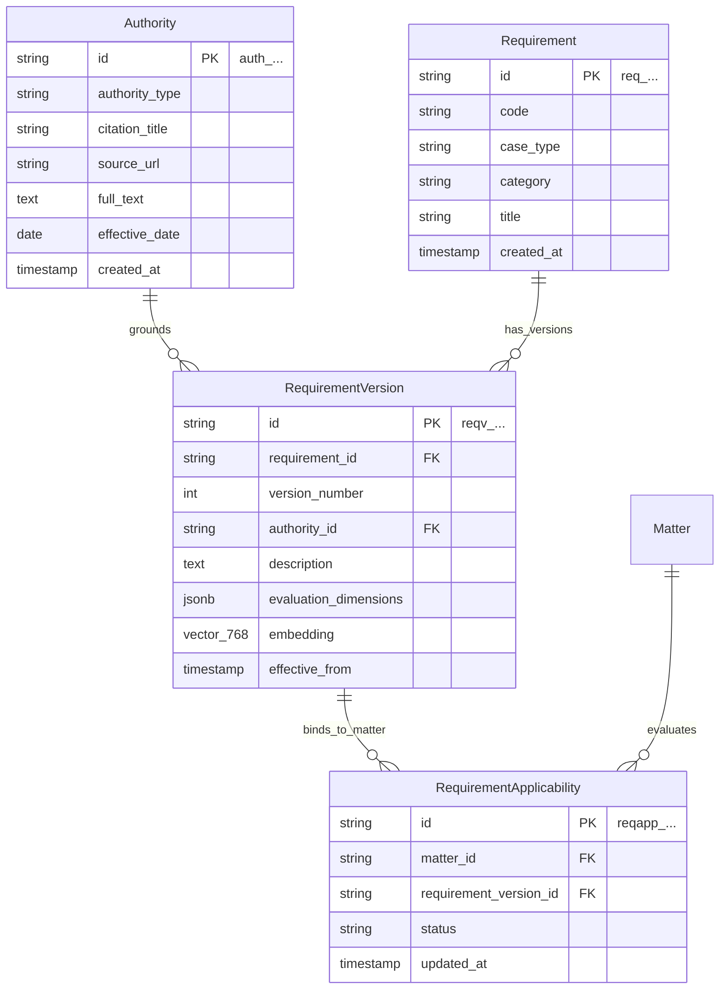

# LexMatter AI — Ontology Layer 4: Legal Knowledge Layer Specification

The **Legal Knowledge Layer** models governing statutes, agency regulations, policy manuals, precedent decisions, and versioned eligibility criteria.

### Core Architectural Principle (Structured Rules vs Hidden Prompts)
* Legal requirements are **not hardcoded into LLM system prompts**. 
* They are modeled as structured, version-controlled database entities with formal **evaluation dimensions** and **dense vector embeddings**. This guarantees that all legal evaluations are reproducible, auditable, and easily updated as immigration regulations evolve.

---

## Entity Relationship Overview (Legal Knowledge Layer)



---

## 1. Model: `Authority`

### 1.1 Purpose
Stores primary authoritative legal sources (statutes, CFR regulations, USCIS Policy Manual volumes, and precedent decisions).

### 1.2 Schema Definition

| Field Name | Type | Nullable | Default | Description / Constraints |
| :--- | :--- | :--- | :--- | :--- |
| `id` | `VARCHAR(32)` | No | Auto-generated | Primary Key. Prefix: `auth_`. |
| `authority_type` | `VARCHAR(50)` | No | — | Enum: `STATUTE`, `REGULATION`, `USCIS_POLICY_MANUAL`, `FORM_INSTRUCTIONS`, `AAO_DECISION`, `PRECEDENT_DECISION`. |
| `citation_title` | `VARCHAR(255)` | No | — | Citation string (e.g., `"8 CFR 214.2(l)(1)(ii)(D) — Specialized Knowledge Definition"`). |
| `jurisdiction` | `VARCHAR(50)` | No | `'US_FEDERAL'` | Jurisdiction code. |
| `source_url` | `VARCHAR(1024)` | Yes | `NULL` | Official publication link (e.g., eCFR or USCIS Policy Manual URI). |
| `full_text` | `TEXT` | No | — | Authoritative statutory or policy text. |
| `effective_date` | `DATE` | Yes | `NULL` | Date this authority became active. |
| `created_at` | `TIMESTAMPTZ` | No | `NOW()` | Ingestion timestamp. |

### 1.3 Indexes & Constraints
* `pk_authorities`: `PRIMARY KEY (id)`
* `idx_authorities_type_citation`: `(authority_type, citation_title)`

### 1.4 Example JSON
```json
{
  "id": "auth_01J8K3ME0A1B2C3D4E5F6G7H8J",
  "authority_type": "REGULATION",
  "citation_title": "8 CFR 214.2(l)(1)(ii)(D) — Specialized Knowledge",
  "jurisdiction": "US_FEDERAL",
  "source_url": "https://www.ecfr.gov/current/title-8/chapter-I/subchapter-B/part-214/section-214.2#p-214.2(l)(1)(ii)(D)",
  "full_text": "Specialized knowledge means special knowledge possessed by an individual of the petitioning organization's product, service, research, equipment, techniques, management, or other interests and its application in international markets, or an advanced level of knowledge or expertise in the organization's processes and procedures.",
  "effective_date": "2015-08-17",
  "created_at": "2026-09-21T10:07:00Z"
}
```

---

## 2. Model: `Requirement`

### 2.1 Purpose
Represents a conceptual legal, evidentiary, or procedural rule that must be evaluated for a case type.

### 2.2 Schema Definition

| Field Name | Type | Nullable | Default | Description / Constraints |
| :--- | :--- | :--- | :--- | :--- |
| `id` | `VARCHAR(32)` | No | Auto-generated | Primary Key. Prefix: `req_` (or code like `req_l1b_specialized_knowledge`). |
| `code` | `VARCHAR(50)` | No | — | Standard code (e.g., `"L1B-REQ-SPECIALIZED-KNOWLEDGE"`). |
| `case_type` | `VARCHAR(50)` | No | `'L1B'` | Enum: `L1B`, `L1A`, `H1B`, `GENERAL`. |
| `category` | `VARCHAR(50)` | No | `'ELIGIBILITY'` | Enum: `ELIGIBILITY`, `EVIDENTIARY`, `PROCEDURAL`. |
| `title` | `VARCHAR(255)` | No | — | Short name (e.g., `"Specialized Knowledge Standard"`). |
| `created_at` | `TIMESTAMPTZ` | No | `NOW()` | Creation timestamp. |

### 2.3 Indexes & Constraints
* `pk_requirements`: `PRIMARY KEY (id)`
* `uq_requirements_code`: `UNIQUE (code)`
* `idx_requirements_case_cat`: `(case_type, category)`

### 2.4 Example JSON
```json
{
  "id": "req_01J8K3ME5E6F7G8H9J0K1L2M3N",
  "code": "L1B-REQ-SPECIALIZED-KNOWLEDGE",
  "case_type": "L1B",
  "category": "ELIGIBILITY",
  "title": "Specialized Knowledge Standard",
  "created_at": "2026-09-21T10:07:05Z"
}
```

---

## 3. Model: `RequirementVersion`

### 3.1 Purpose
Tracks versioned definitions of requirements, specifying exact evaluation dimensions and containing dense vector embeddings for hybrid retrieval matching against evidence.

### 3.2 Schema Definition

| Field Name | Type | Nullable | Default | Description / Constraints |
| :--- | :--- | :--- | :--- | :--- |
| `id` | `VARCHAR(32)` | No | Auto-generated | Primary Key. Prefix: `reqv_`. |
| `requirement_id` | `VARCHAR(32)` | No | — | Foreign Key -> `requirements.id` (ON DELETE CASCADE). |
| `version_number` | `INTEGER` | No | `1` | Sequential version. |
| `authority_id` | `VARCHAR(32)` | Yes | `NULL` | Foreign Key -> `authorities.id` (Governing legal authority). |
| `description` | `TEXT` | No | — | Comprehensive legal explanation of the standard. |
| `evaluation_dimensions` | `JSONB` | No | `[]` | Checkpoints to evaluate (e.g., `["proprietary_nature", "advanced_expertise", "industry_comparison", "beneficiary_possession"]`). |
| `embedding` | `vector(768)` | Yes | `NULL` | Dense embedding for semantic evidence matching. |
| `effective_from` | `DATE` | No | `'2020-01-01'` | Effective start date. |
| `effective_to` | `DATE` | Yes | `NULL` | Sunset date (NULL if currently active). |

### 3.3 Indexes & Constraints
* `pk_requirement_versions`: `PRIMARY KEY (id)`
* `fk_req_versions_req`: `FOREIGN KEY (requirement_id) REFERENCES requirements(id)`
* `fk_req_versions_auth`: `FOREIGN KEY (authority_id) REFERENCES authorities(id)`
* `uq_req_versions_num`: `UNIQUE (requirement_id, version_number)`
* `idx_req_versions_vector_hnsw`: `USING hnsw (embedding vector_cosine_ops) WITH (m = 16, ef_construction = 64)`

### 3.4 Example JSON
```json
{
  "id": "reqv_01J8K3MF0A1B2C3D4E5F6G7H8J",
  "requirement_id": "req_01J8K3ME5E6F7G8H9J0K1L2M3N",
  "version_number": 1,
  "authority_id": "auth_01J8K3ME0A1B2C3D4E5F6G7H8J",
  "description": "The beneficiary must possess specialized knowledge—either proprietary knowledge of the petitioning organization's product/service or an advanced level of expertise in processes and procedures.",
  "evaluation_dimensions": [
    "proprietary_product_or_process",
    "advanced_expertise_level",
    "organizational_comparison",
    "beneficiary_possession_evidence"
  ],
  "embedding": [0.0512, -0.0219, 0.0831, 0.0124, -0.0418],
  "effective_from": "2015-08-17",
  "effective_to": null
}
```

---

## 4. Model: `RequirementApplicability`

### 4.1 Purpose
Associates a versioned requirement with a specific `Matter` and maintains high-level case readiness status for that requirement.

### 4.2 Schema Definition

| Field Name | Type | Nullable | Default | Description / Constraints |
| :--- | :--- | :--- | :--- | :--- |
| `id` | `VARCHAR(32)` | No | Auto-generated | Primary Key. Prefix: `reqapp_`. |
| `matter_id` | `VARCHAR(32)` | No | — | Foreign Key -> `matters.id` (ON DELETE CASCADE). |
| `requirement_version_id` | `VARCHAR(32)` | No | — | Foreign Key -> `requirement_versions.id` (ON DELETE RESTRICT). |
| `status` | `VARCHAR(50)` | No | `'NOT_EVALUATED'` | Enum: `NOT_EVALUATED`, `EVIDENCE_LOCATED`, `PARTIAL_SUPPORT`, `CONFLICT_DETECTED`, `POTENTIAL_GAP`, `HUMAN_VERIFIED`. |
| `notes` | `TEXT` | Yes | `NULL` | Case-specific analytical notes. |
| `created_at` | `TIMESTAMPTZ` | No | `NOW()` | Creation timestamp. |
| `updated_at` | `TIMESTAMPTZ` | No | `NOW()` | Update timestamp. |

### 4.3 Indexes & Constraints
* `pk_requirement_applicability`: `PRIMARY KEY (id)`
* `fk_reqapp_matter`: `FOREIGN KEY (matter_id) REFERENCES matters(id)`
* `fk_reqapp_req_version`: `FOREIGN KEY (requirement_version_id) REFERENCES requirement_versions(id)`
* `uq_reqapp_matter_version`: `UNIQUE (matter_id, requirement_version_id)`
* `idx_reqapp_status`: `(matter_id, status)`

### 4.4 Example JSON
```json
{
  "id": "reqapp_01J8K3MF5E6F7G8H9J0K1L2M3N",
  "matter_id": "mat_01J8K3M90A1B2C3D4E5F6G7H8J",
  "requirement_version_id": "reqv_01J8K3MF0A1B2C3D4E5F6G7H8J",
  "status": "EVIDENCE_LOCATED",
  "notes": "Evidence identified in Support Letter and Training Records. Moderate corroboration from project documentation.",
  "created_at": "2026-09-21T10:07:15Z",
  "updated_at": "2026-09-21T10:10:00Z"
}
```
