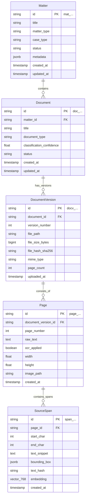

# LexMatter AI — Ontology Layer 1: Source Layer Specification

The **Source Layer** models the physical, layout, and textual hierarchy of uploaded case documents. All entities in this layer are **deterministic and non-interpretive**. They represent exactly what was ingested, where it is stored, how it is organized by pages, and the exact character-level/bounding-box coordinates (`SourceSpan`) required for absolute legal source provenance.

---

## Entity Relationship Overview (Source Layer)



---

## 1. Model: `Matter`

### 1.1 Purpose
`Matter` is the root container and multi-tenant workspace for any legal case or compliance review package. All documents, extractions, canonical facts, evidence mappings, findings, and human reviews belong to a single `Matter`.

### 1.2 Schema Definition

| Field Name | Type | Nullable | Default | Description / Constraints |
| :--- | :--- | :--- | :--- | :--- |
| `id` | `VARCHAR(32)` | No | Auto-generated | Primary Key. Prefix: `mat_` (e.g., `mat_01HGBX...`). |
| `title` | `VARCHAR(255)` | No | — | Human-readable title (e.g., `"Apex Global - John Doe L-1B Petition"`). |
| `matter_type` | `VARCHAR(50)` | No | `'IMMIGRATION'` | Enum: `IMMIGRATION`, `LITIGATION`, `COMPLIANCE`, `CONTRACT_REVIEW`. |
| `case_type` | `VARCHAR(50)` | No | `'L1B'` | Enum: `L1B`, `L1A`, `H1B`, `O1`, `EB1`, `EB2_NIW`, `GENERAL`. |
| `status` | `VARCHAR(50)` | No | `'DRAFT'` | Enum: `DRAFT`, `INGESTING`, `ANALYZING`, `UNDER_REVIEW`, `READY`, `ARCHIVED`. |
| `filing_type` | `VARCHAR(50)` | Yes | `NULL` | Enum: `INDIVIDUAL`, `BLANKET`, `AMENDMENT`, `EXTENSION`. |
| `metadata` | `JSONB` | No | `{}` | Extensible metadata (petitioner name, beneficiary name, internal matter ID). |
| `created_at` | `TIMESTAMPTZ` | No | `NOW()` | Audit timestamp. |
| `updated_at` | `TIMESTAMPTZ` | No | `NOW()` | Audit timestamp. |

### 1.3 Indexes
* `pk_matters`: `PRIMARY KEY (id)`
* `idx_matters_type_status`: `(matter_type, case_type, status)`
* `idx_matters_metadata_gin`: `USING GIN (metadata)`

### 1.4 Example JSON
```json
{
  "id": "mat_01J8K3M90A1B2C3D4E5F6G7H8J",
  "title": "Apex Technologies Inc. - Rajesh Sharma L-1B Petition",
  "matter_type": "IMMIGRATION",
  "case_type": "L1B",
  "status": "UNDER_REVIEW",
  "filing_type": "INDIVIDUAL",
  "metadata": {
    "petitioner": "Apex Technologies Inc.",
    "beneficiary": "Rajesh Sharma",
    "target_office": "San Jose, CA",
    "internal_ref": "IMM-2026-089"
  },
  "created_at": "2026-09-21T10:00:00Z",
  "updated_at": "2026-09-21T10:15:00Z"
}
```

---

## 2. Model: `Document`

### 2.1 Purpose
Represents a logical document within a matter (e.g., "Petition Support Letter", "Resume", "Company Org Chart"). Multiple physical uploads of the same logical document are tracked via `DocumentVersion`.

### 2.2 Schema Definition

| Field Name | Type | Nullable | Default | Description / Constraints |
| :--- | :--- | :--- | :--- | :--- |
| `id` | `VARCHAR(32)` | No | Auto-generated | Primary Key. Prefix: `doc_`. |
| `matter_id` | `VARCHAR(32)` | No | — | Foreign Key -> `matters.id` (ON DELETE CASCADE). |
| `title` | `VARCHAR(255)` | No | — | Display name (e.g., `"Employer_Support_Letter.pdf"`). |
| `document_type` | `VARCHAR(50)` | No | `'UNKNOWN'` | Enum: `PETITION_LETTER`, `RESUME`, `EMPLOYMENT_LETTER`, `ORG_CHART`, `TRAINING_RECORD`, `PAYROLL_RECORD`, `USCIS_FORM`, `COMPANY_DOCUMENT`, `EXHIBIT`, `UNKNOWN`. |
| `classification_confidence` | `FLOAT` | Yes | `NULL` | Model confidence score (`0.0` to `1.0`). |
| `status` | `VARCHAR(50)` | No | `'PENDING'` | Enum: `PENDING`, `PROCESSED`, `FAILED`, `ARCHIVED`. |
| `created_at` | `TIMESTAMPTZ` | No | `NOW()` | Audit timestamp. |
| `updated_at` | `TIMESTAMPTZ` | No | `NOW()` | Audit timestamp. |

### 2.3 Indexes & Constraints
* `pk_documents`: `PRIMARY KEY (id)`
* `fk_documents_matter`: `FOREIGN KEY (matter_id) REFERENCES matters(id)`
* `idx_documents_matter_type`: `(matter_id, document_type)`

### 2.4 Example JSON
```json
{
  "id": "doc_01J8K3M95Z9Y8X7W6V5U4T3S2R",
  "matter_id": "mat_01J8K3M90A1B2C3D4E5F6G7H8J",
  "title": "Apex_Technologies_L1B_Support_Letter.pdf",
  "document_type": "PETITION_LETTER",
  "classification_confidence": 0.98,
  "status": "PROCESSED",
  "created_at": "2026-09-21T10:02:00Z",
  "updated_at": "2026-09-21T10:05:00Z"
}
```

---

## 3. Model: `DocumentVersion`

### 3.1 Purpose
Tracks the immutable physical file associated with a `Document`. Allows versioning when replacement or amended files are uploaded without breaking historical citations.

### 3.2 Schema Definition

| Field Name | Type | Nullable | Default | Description / Constraints |
| :--- | :--- | :--- | :--- | :--- |
| `id` | `VARCHAR(32)` | No | Auto-generated | Primary Key. Prefix: `docv_`. |
| `document_id` | `VARCHAR(32)` | No | — | Foreign Key -> `documents.id` (ON DELETE CASCADE). |
| `version_number` | `INTEGER` | No | `1` | Sequential version (1, 2, 3...). |
| `file_path` | `VARCHAR(1024)` | No | — | Storage URI (e.g., `uploads/mat_.../docv_...pdf`). |
| `file_size_bytes` | `BIGINT` | No | — | File size in bytes. |
| `file_hash_sha256` | `CHAR(64)` | No | — | SHA-256 hash for deduplication and tamper detection. |
| `mime_type` | `VARCHAR(100)` | No | `'application/pdf'` | MIME type. |
| `page_count` | `INTEGER` | No | `0` | Total number of pages. |
| `uploaded_at` | `TIMESTAMPTZ` | No | `NOW()` | Upload timestamp. |

### 3.3 Indexes & Constraints
* `pk_document_versions`: `PRIMARY KEY (id)`
* `fk_document_versions_doc`: `FOREIGN KEY (document_id) REFERENCES documents(id)`
* `uq_document_versions_num`: `UNIQUE (document_id, version_number)`
* `idx_document_versions_hash`: `(file_hash_sha256)`

### 3.4 Example JSON
```json
{
  "id": "docv_01J8K3M99B8A7Z6Y5X4W3V2U1T",
  "document_id": "doc_01J8K3M95Z9Y8X7W6V5U4T3S2R",
  "version_number": 1,
  "file_path": "storage/mat_01J8K3M90A1B2C3D4E5F6G7H8J/docv_01J8K3M99B8A7Z6Y5X4W3V2U1T.pdf",
  "file_size_bytes": 2458900,
  "file_hash_sha256": "e3b0c44298fc1c149afbf4c8996fb92427ae41e4649b934ca495991b7852b855",
  "mime_type": "application/pdf",
  "page_count": 14,
  "uploaded_at": "2026-09-21T10:02:05Z"
}
```

---

## 4. Model: `Page`

### 4.1 Purpose
Stores page-level extracted text, layout dimensions, and OCR metadata for a specific document version.

### 4.2 Schema Definition

| Field Name | Type | Nullable | Default | Description / Constraints |
| :--- | :--- | :--- | :--- | :--- |
| `id` | `VARCHAR(32)` | No | Auto-generated | Primary Key. Prefix: `page_`. |
| `document_version_id` | `VARCHAR(32)` | No | — | Foreign Key -> `document_versions.id` (ON DELETE CASCADE). |
| `page_number` | `INTEGER` | No | — | 1-indexed page position in the PDF. |
| `raw_text` | `TEXT` | No | `''` | Full text extracted from this page. |
| `ocr_applied` | `BOOLEAN` | No | `FALSE` | `TRUE` if scanned image OCR (Tesseract) was used. |
| `width` | `FLOAT` | No | `612.0` | Page width in PDF points (standard Letter = 612). |
| `height` | `FLOAT` | No | `792.0` | Page height in PDF points (standard Letter = 792). |
| `image_path` | `VARCHAR(1024)` | Yes | `NULL` | Path to rendered page preview PNG image. |
| `created_at` | `TIMESTAMPTZ` | No | `NOW()` | Creation timestamp. |

### 4.3 Indexes & Constraints
* `pk_pages`: `PRIMARY KEY (id)`
* `fk_pages_doc_version`: `FOREIGN KEY (document_version_id) REFERENCES document_versions(id)`
* `uq_pages_version_num`: `UNIQUE (document_version_id, page_number)`

### 4.4 Example JSON
```json
{
  "id": "page_01J8K3MA1C2D3E4F5G6H7J8K9L",
  "document_version_id": "docv_01J8K3M99B8A7Z6Y5X4W3V2U1T",
  "page_number": 3,
  "raw_text": "APEX TECHNOLOGIES INC. ... Specialized Knowledge Overview: The Beneficiary possesses proprietary knowledge of the Apex Titan Risk Engine ...",
  "ocr_applied": false,
  "width": 612.0,
  "height": 792.0,
  "image_path": "storage/previews/page_01J8K3MA1C2D3E4F5G6H7J8K9L.png",
  "created_at": "2026-09-21T10:02:10Z"
}
```

---

## 5. Model: `SourceSpan` — Provenance Foundation

### 5.1 Purpose
`SourceSpan` is the foundational atom of legal provenance in LexMatter AI. Every assertion, canonical fact candidate, conflict, evidence link, and agent finding must link to one or more `SourceSpan` records. It stores the exact character offset, bounding box coordinates for UI highlighting, and a vector embedding for hybrid retrieval.

### 5.2 Schema Definition

| Field Name | Type | Nullable | Default | Description / Constraints |
| :--- | :--- | :--- | :--- | :--- |
| `id` | `VARCHAR(32)` | No | Auto-generated | Primary Key. Prefix: `span_`. |
| `page_id` | `VARCHAR(32)` | No | — | Foreign Key -> `pages.id` (ON DELETE CASCADE). |
| `start_char` | `INTEGER` | No | — | Character start index within `Page.raw_text`. |
| `end_char` | `INTEGER` | No | — | Character end index within `Page.raw_text`. |
| `text_snippet` | `TEXT` | No | — | The exact verbatim text snippet. |
| `bounding_box` | `JSONB` | Yes | `NULL` | Coordinates: `{"x1": float, "y1": float, "x2": float, "y2": float}`. |
| `text_hash` | `CHAR(64)` | No | — | SHA-256 hash of `text_snippet` to verify immutability. |
| `embedding` | `vector(768)` | Yes | `NULL` | Dense embedding vector (SentenceTransformers `all-mpnet-base-v2` / `nomic-embed-text`). |
| `created_at` | `TIMESTAMPTZ` | No | `NOW()` | Creation timestamp. |

### 5.3 Indexes & Constraints
* `pk_source_spans`: `PRIMARY KEY (id)`
* `fk_source_spans_page`: `FOREIGN KEY (page_id) REFERENCES pages(id)`
* `idx_source_spans_hash`: `(text_hash)`
* `idx_source_spans_vector_hnsw`: `USING hnsw (embedding vector_cosine_ops) WITH (m = 16, ef_construction = 64)`

### 5.4 Example JSON
```json
{
  "id": "span_01J8K3MA7M8N9P0Q1R2S3T4U5V",
  "page_id": "page_01J8K3MA1C2D3E4F5G6H7J8K9L",
  "start_char": 420,
  "end_char": 575,
  "text_snippet": "The Beneficiary possesses proprietary knowledge of the Apex Titan Risk Engine, having led its core architecture development at Apex India Pvt. Ltd. from June 2021 to Present.",
  "bounding_box": {
    "x1": 72.0,
    "y1": 210.5,
    "x2": 540.0,
    "y2": 248.0
  },
  "text_hash": "a4f5c9e2b1037d456789abcdef1234567890abcdef1234567890abcdef123456",
  "embedding": [0.0312, -0.0481, 0.0129, 0.0712, -0.0094],
  "created_at": "2026-09-21T10:02:15Z"
}
```
