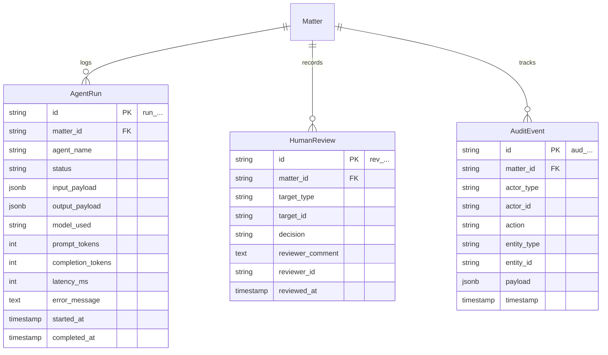

# LexMatter AI — Ontology Layer 6: Workflow & Audit Layer Specification

The **Workflow & Audit Layer** ensures complete observability, execution tracking, cost measurement, and interactive human-in-the-loop governance for all agent actions.

### Core Architectural Principle (Audited Autonomy & Human-in-the-Loop)
* Every LangGraph agent run is tracked with model parameters, token usage, latency, and inputs/outputs.
* Every analytical finding or conflict resolution requires an explicit, permanent `HumanReview` decision record.
* Security and compliance actions are written to an append-only `AuditEvent` log.

---

## Entity Relationship Overview (Workflow & Audit Layer)



---

## 1. Model: `AgentRun`

### 1.1 Purpose
Tracks an individual execution of a LangGraph agent or subagent graph node. Enables debugging, token cost tracking, and workflow reproducibility.

### 1.2 Schema Definition

| Field Name | Type | Nullable | Default | Description / Constraints |
| :--- | :--- | :--- | :--- | :--- |
| `id` | `VARCHAR(32)` | No | Auto-generated | Primary Key. Prefix: `run_`. |
| `matter_id` | `VARCHAR(32)` | No | — | Foreign Key -> `matters.id` (ON DELETE CASCADE). |
| `agent_name` | `VARCHAR(50)` | No | — | Enum: `CASE_SUPERVISOR`, `EVIDENCE_ANALYST`, `CONSISTENCY_ANALYST`, `RESEARCH_AGENT`, `VERIFICATION_AGENT`. |
| `status` | `VARCHAR(50)` | No | `'QUEUED'` | Enum: `QUEUED`, `RUNNING`, `COMPLETED`, `FAILED`, `CANCELLED`. |
| `input_payload` | `JSONB` | No | `{}` | Agent invocation input arguments. |
| `output_payload` | `JSONB` | Yes | `NULL` | Structured output payload from agent state. |
| `model_used` | `VARCHAR(100)` | No | — | Model identifier (e.g., `"gemini-1.5-pro"`, `"qwen2.5-14b"`). |
| `prompt_tokens` | `INTEGER` | No | `0` | Input token count. |
| `completion_tokens` | `INTEGER` | No | `0` | Generated token count. |
| `latency_ms` | `INTEGER` | Yes | `NULL` | Wall-clock execution time in milliseconds. |
| `error_message` | `TEXT` | Yes | `NULL` | Stack trace or failure description if failed. |
| `started_at` | `TIMESTAMPTZ` | No | `NOW()` | Run start timestamp. |
| `completed_at` | `TIMESTAMPTZ` | Yes | `NULL` | Run completion timestamp. |

### 1.3 Indexes & Constraints
* `pk_agent_runs`: `PRIMARY KEY (id)`
* `fk_agent_runs_matter`: `FOREIGN KEY (matter_id) REFERENCES matters(id)`
* `idx_agent_runs_status`: `(matter_id, agent_name, status)`

### 1.4 Example JSON
```json
{
  "id": "run_01J8K3MJ0A1B2C3D4E5F6G7H8J",
  "matter_id": "mat_01J8K3M90A1B2C3D4E5F6G7H8J",
  "agent_name": "CONSISTENCY_ANALYST",
  "status": "COMPLETED",
  "input_payload": {
    "scope": "FOREIGN_EMPLOYMENT_DATES",
    "assertion_count": 14
  },
  "output_payload": {
    "conflicts_detected": 1,
    "corroborated_facts": 3
  },
  "model_used": "gemini-1.5-pro",
  "prompt_tokens": 1420,
  "completion_tokens": 310,
  "latency_ms": 2340,
  "error_message": null,
  "started_at": "2026-09-21T10:08:00Z",
  "completed_at": "2026-09-21T10:08:02Z"
}
```

---

## 2. Model: `HumanReview` — First-Class Review Object

### 2.1 Purpose
Stores review decisions made by attorneys or legal staff on findings, conflicts, evidence mappings, and gap assessments.

### 2.2 Schema Definition

| Field Name | Type | Nullable | Default | Description / Constraints |
| :--- | :--- | :--- | :--- | :--- |
| `id` | `VARCHAR(32)` | No | Auto-generated | Primary Key. Prefix: `rev_`. |
| `matter_id` | `VARCHAR(32)` | No | — | Foreign Key -> `matters.id` (ON DELETE CASCADE). |
| `target_type` | `VARCHAR(50)` | No | — | Enum: `FINDING`, `CONFLICT`, `EVIDENCE_GAP`, `EVIDENCE_MAPPING`. |
| `target_id` | `VARCHAR(32)` | No | — | ID of target entity (e.g., `find_...`, `conf_...`, `gap_...`). |
| `decision` | `VARCHAR(50)` | No | — | Enum: `ACCEPT`, `REJECT`, `MODIFY`, `NEEDS_MORE_RESEARCH`, `UNRESOLVED`. |
| `reviewer_comment` | `TEXT` | Yes | `NULL` | Explanatory note by reviewer. |
| `reviewer_id` | `VARCHAR(100)` | No | — | Reviewer user identity / email. |
| `reviewed_at` | `TIMESTAMPTZ` | No | `NOW()` | Review timestamp. |

### 2.3 Indexes & Constraints
* `pk_human_reviews`: `PRIMARY KEY (id)`
* `fk_human_reviews_matter`: `FOREIGN KEY (matter_id) REFERENCES matters(id)`
* `idx_human_reviews_target`: `(target_type, target_id)`
* `idx_human_reviews_matter`: `(matter_id, decision)`

### 2.4 Example JSON
```json
{
  "id": "rev_01J8K3MJ5E6F7G8H9J0K1L2M3N",
  "matter_id": "mat_01J8K3M90A1B2C3D4E5F6G7H8J",
  "target_type": "FINDING",
  "target_id": "find_01J8K3MG5E6F7G8H9J0K1L2M3N",
  "decision": "ACCEPT",
  "reviewer_comment": "Confirmed discrepancy between resume and employment letter. Will request an updated resume from beneficiary.",
  "reviewer_id": "attorney.sarah@lexfirm.com",
  "reviewed_at": "2026-09-21T10:15:00Z"
}
```

---

## 3. Model: `AuditEvent`

### 3.1 Purpose
Append-only immutable audit trail capturing all state mutations, document accesses, and automated runs for SOC2/ISO compliance and legal defensibility.

### 3.2 Schema Definition

| Field Name | Type | Nullable | Default | Description / Constraints |
| :--- | :--- | :--- | :--- | :--- |
| `id` | `VARCHAR(32)` | No | Auto-generated | Primary Key. Prefix: `aud_`. |
| `matter_id` | `VARCHAR(32)` | No | — | Foreign Key -> `matters.id` (ON DELETE CASCADE). |
| `actor_type` | `VARCHAR(50)` | No | — | Enum: `USER`, `AGENT`, `SYSTEM`. |
| `actor_id` | `VARCHAR(100)` | No | — | Identity of actor (e.g., `"user_sarah"`, `"agent_consistency"`). |
| `action` | `VARCHAR(100)` | No | — | Action verb (e.g., `"DOCUMENT_UPLOADED"`, `"CONFLICT_RESOLVED"`, `"FINDING_ACCEPTED"`). |
| `entity_type` | `VARCHAR(50)` | No | — | Target entity table (e.g., `"Finding"`, `"Conflict"`). |
| `entity_id` | `VARCHAR(32)` | No | — | Target entity ID. |
| `payload` | `JSONB` | No | `{}` | Diff or audit context payload. |
| `timestamp` | `TIMESTAMPTZ` | No | `NOW()` | Event timestamp. |

### 3.3 Indexes & Constraints
* `pk_audit_events`: `PRIMARY KEY (id)`
* `fk_audit_events_matter`: `FOREIGN KEY (matter_id) REFERENCES matters(id)`
* `idx_audit_events_matter_time`: `(matter_id, timestamp DESC)`

### 3.4 Example JSON
```json
{
  "id": "aud_01J8K3MK0A1B2C3D4E5F6G7H8J",
  "matter_id": "mat_01J8K3M90A1B2C3D4E5F6G7H8J",
  "actor_type": "USER",
  "actor_id": "attorney.sarah@lexfirm.com",
  "action": "FINDING_ACCEPTED",
  "entity_type": "Finding",
  "entity_id": "find_01J8K3MG5E6F7G8H9J0K1L2M3N",
  "payload": {
    "previous_status": "PENDING_REVIEW",
    "new_status": "ACCEPTED",
    "review_id": "rev_01J8K3MJ5E6F7G8H9J0K1L2M3N"
  },
  "timestamp": "2026-09-21T10:15:02Z"
}
```
